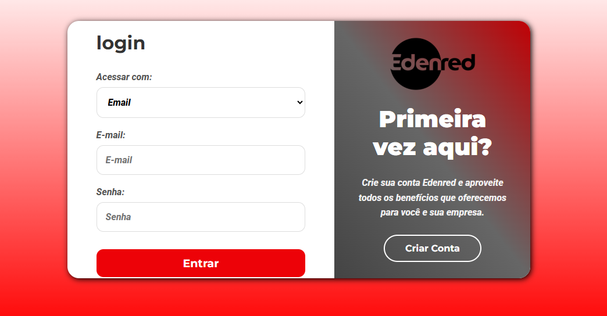
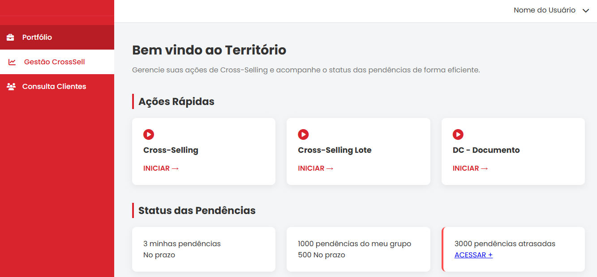
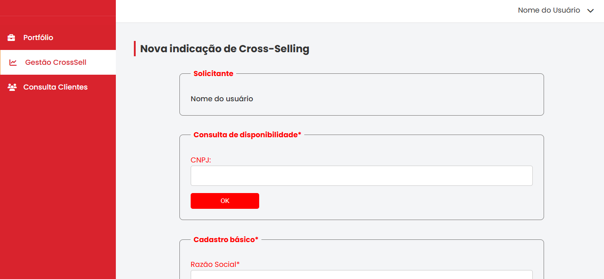

# Protótipo Funcional - Desafio Edenred


> **Status do Projeto:** Em Desenvolvimento 🚀

## 📜 Visão Geral

Este projeto é a implementação de um desafio técnico proposto pela Edenred. O que começou como um protótipo de front-end baseado num fluxo de usuário em PDF evoluiu para uma aplicação web funcional, utilizando **Firebase** para a autenticação de utilizadores e gestão de estado. A aplicação replica fielmente o design e a experiência do utilizador propostos, agora com uma camada de back-end para funcionalidades dinâmicas.

---

## 🚀 Demo Ao Vivo

A aplicação está hospedada e pode ser testada ao vivo através do GitHub Pages.

**➡️ [Aceder à Demo Ao Vivo](https://aiam-m.github.io/frontend-challenge-dashboard/)**

**Nota:** Para testar o fluxo de login e aceder ao dashboard, por favor, utilize as credenciais de teste fornecidas no e-mail de submissão do projeto. A funcionalidade de registo de novos utilizadores está em desenvolvimento.

---

## ✨ Funcionalidades Implementadas

- **Autenticação de Utilizadores:** Sistema de login funcional e seguro utilizando o serviço **Firebase Authentication**.
- **Rotas Protegidas:** O dashboard e as páginas de formulários são privadas e só podem ser acedidas por utilizadores autenticados. Tentativas de acesso direto redirecionam para a página de login.
- **Fluxo de Navegação Principal:** A aplicação implementa o percurso lógico principal: Página de Marketing → Login → Dashboard e, ao clicar em **"Iniciar"** na opção **"Gestão Cross-Selling"**, o utilizador é levado ao formulário de indicação.
- **Estrutura de Código Moderna:** Utilização de Módulos JavaScript (ES6 `import`/`export`) para uma arquitetura de código limpa, organizada e escalável.
- **Interface Fiel ao Design:** O front-end foi construído do zero com HTML5 semântico e CSS3 (Flexbox), replicando a interface proposta.

---

## 🛠️ Tecnologias Utilizadas

- **Front-End:**
  - HTML5
  - CSS3 (Flexbox para layouts responsivos)
  - JavaScript (ES6+)
    - Módulos (`import`/`export`)
    - Promises (`.then` / `.catch`) para lidar com operações assíncronas
- **Back-End (BaaS):**
  - **Firebase Authentication** para gestão de utilizadores.
- **Ferramentas de Desenvolvimento:**
  - Git & GitHub para controlo de versão.
  - VS Code com a extensão **Live Server** para desenvolvimento local.

---

## 📸 Screenshots

<table>
  <tr>
    <td align="center"><strong>Página de Login</strong></td>
    <td align="center"><strong>Dashboard (Após Login)</strong></td>
    <td align="center"><strong>Formulário de Indicação</strong></td>
  </tr>
  <tr>
    <td></td>
    <td></td>
    <td></td>
  </tr>
</table>

---

## 📖 Como Executar Localmente

Para executar este projeto na sua máquina, siga os passos abaixo:

1.  **Clone o repositório:**
    ```sh
    git clone https://github.com/aiam-m/frontend-challenge-dashboard.git
    ```

2.  **Navegue até a pasta do projeto:**
    ```sh
    cd frontend-challenge-dashboard
    ```

3.  **Configure o Firebase:**
    -   Na raiz do projeto, você encontrará um ficheiro chamado `firebaseconfig.example.js`.
    -   **Renomeie ou copie** este ficheiro para `firebaseconfig.js`.
    -   Abra o novo `firebaseconfig.js` e **substitua os valores de placeholder** pelas chaves do seu próprio projeto Firebase, como no exemplo:
    ```javascript
    // firebaseconfig.js
    import { initializeApp } from "...";
    import { getAuth } from "...";
    
    const firebaseConfig = { /* SUAS CHAVES AQUI */ };
    const app = initializeApp(firebaseConfig);
    export const auth = getAuth(app);
    ```

4.  **Inicie um servidor local:**
    -   Este projeto usa Módulos JavaScript e precisa de ser servido por um protocolo `http://`.
    -   Se você usa o VS Code, simplesmente clique com o botão direito no ficheiro `LoginEden.html` (ou a sua página de entrada) e selecione **"Open with Live Server"**.

---

## 🎯 Próximos Passos

Este projeto é uma base sólida e o meu plano é continuar a evoluí-lo, implementando as seguintes funcionalidades:
- [ ] **Refinamento da Responsividade:** Garantir que todos os componentes, incluindo os formulários, sejam 100% fluidos em dispositivos móveis.
- [ ] **Feedback ao Utilizador:** Adicionar indicadores de carregamento (loading spinners) e mensagens de sucesso/erro mais elegantes.
